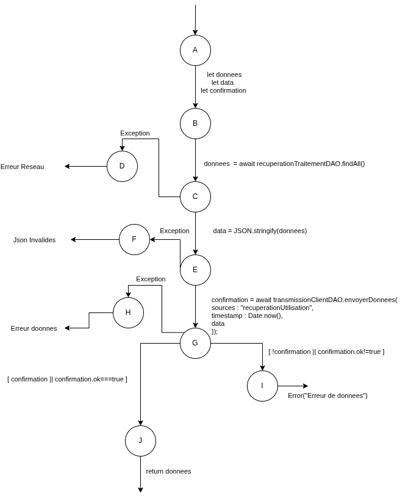

# Tests de recuperation - `recuperationUtilisationDAO`

## Tests fonctionnels

### Etape n1

L'oracle verifie que `envoyerRequete` retourne soit :

- les donnees recuperees quand la chaine complete reussit,
- soit une erreur metier selon l'etape qui echoue.

### Etape n2

`recuperationUtilisationDAO.envoyerRequete` ne prend pas de parametre direct.
Le comportement depend de :

- `recuperationTraitementDAO.findAll`,
- `JSON.stringify`,
- `transmissionClientDAO.envoyerDonnees`,
- la validation de confirmation (`confirmation.ok === true`).

### Etape n3

Les cas de test sont definis par les etats possibles de ces dependances mockees.

## Tests structurels

Le flux principal est le suivant :

- recuperation des donnees (`findAll`)
- serialisation (`JSON.stringify`)
- transmission (`envoyerDonnees`)
- validation de confirmation
- retour des donnees

Branches d'erreur couvertes :

- erreur reseau sur `findAll`
- erreur de serialisation
- erreur d'envoi
- confirmation invalide

## Cas de tests

### Donnees de test (DT)

| ID | findAll_ok | stringify_ok | envoyer_ok | confirmation_ok | Comportement |
|---|---|---|---|---|---|
| DT1 | true | true | true | true | Succes complet |
| DT2 | false | - | - | - | Erreur reseau lors de la recuperation |
| DT3 | true | false | - | - | Format des donnees invalide |
| DT4 | true | true | false | - | Donnees invalides ou incompletes a l'envoi |
| DT5 | true | true | true | false | Donnees invalides ou incompletes a la confirmation |

### Correspondance CT <-> DT

| CT | DT | Chemin principal | Resultat attendu |
|---|---|---|---|
| CT1 | DT1(findAll_ok = true, stringify_ok = true, envoyer_ok = true, confirmation_ok = true) | `findAll -> stringify -> envoyer -> confirmation` | `return donnees` |
| CT2 | DT2(findAll_ok = false) | `findAll` (erreur) | `Erreur de reseau lors de la recuperation des donnees` |
| CT3 | DT3(findAll_ok = true, stringify_ok = false) | `findAll -> stringify` (erreur) | `Le format des donnees recues est invalide` |
| CT4 | DT4(findAll_ok = true, stringify_ok = true, envoyer_ok = false) | `findAll -> stringify -> envoyer` (erreur) | `Les donnees recues sont invalides ou incompletes` |
| CT5 | DT5(findAll_ok = true, stringify_ok = true, envoyer_ok = true, confirmation_ok = false) | `findAll -> stringify -> envoyer -> confirmation` (erreur) | `Les donnees recues sont invalides ou incompletes` |
