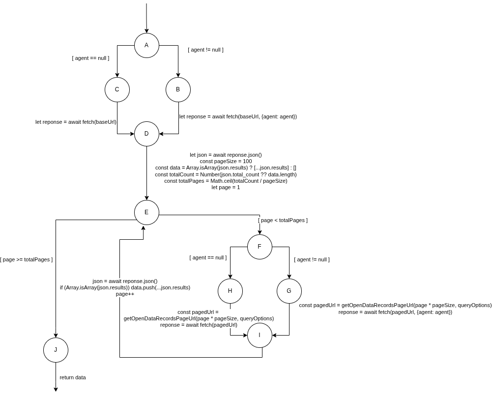

# Tests de recuperation - `stationFetchDAO`

## Tests fonctionnels

### Etape n1

L'oracle verifie que `findAll` retourne soit :

- une liste de resultats (`json.results` ou concat des pages),
- soit une erreur quand un appel `fetch` echoue.

### Etape n2

`stationFetchDAO.findAll` ne prend pas de parametre direct.
Le comportement depend de :

- la presence du proxy (`agent != null` ou `agent == null`),
- la pagination (`page < totalPages`),
- les erreurs de recuperation (initiale ou page suivante).

### Etape n3

Les cas de test sont definis par les comportements de la dependance externe (`fetch`) et les branches du flux drawio.

## Tests structurels

Le drawio actuel decrit le flux suivant :

- `A` : test presence `agent`
- `B` / `C` : fetch initial avec / sans agent
- `D` : lecture `json`, calcul `totalPages`
- `E` : decision pagination
- `F` : test `agent` pour page suivante
- `G` / `H` : fetch page suivante avec / sans agent
- `I` : push `results`, increment `page`
- `J` : retour `data`

## Cas de tests

### Donnees de test (DT)

| ID | agent | total_count | Comportement |
|---|---|---|---|
| DT1 | `null` | `80` | Succes simple page |
| DT2 | `null` | `350` | Succes pagination complete |
| DT3 | `null` | `400` | Erreur page suivante |
| DT4 | `null` | - | Echec fetch initial |
| DT5 | `!= null` | `100` | Succes simple page |
| DT6 | `!= null` | `250` | Succes pagination complete |
| DT7 | `!= null` | `300` | Erreur page suivante |
| DT8 | `!= null` | - | Echec fetch initial |

### Correspondance CT <-> DT

| CT | DT | Chemin drawio principal | Resultat attendu |
|---|---|---|---|
| CT1 | DT1(agent = null, total_count = 80) | `A -> C -> D -> E(false) -> J` | `json.results` |
| CT2 | DT2(agent = null, total_count = 350) | `A -> C -> D -> E(true) -> F -> H -> I -> ... -> J` | `concat(all pages)` |
| CT3 | DT3(agent = null, total_count = 400, erreur_page_suivante = true) | `A -> C -> D -> E(true) -> F -> H` (erreur) | `throw error` |
| CT4 | DT4(agent = null, fetch_initial_fail = true) | `A -> C` (erreur) | `throw error` |
| CT5 | DT5(agent != null, total_count = 100) | `A -> B -> D -> E(false) -> J` | `json.results` |
| CT6 | DT6(agent != null, total_count = 250) | `A -> B -> D -> E(true) -> F -> G -> I -> ... -> J` | `concat(all pages)` |
| CT7 | DT7(agent != null, total_count = 300, erreur_page_suivante = true) | `A -> B -> D -> E(true) -> F -> G` (erreur) | `throw error` |
| CT8 | DT8(agent != null, fetch_initial_fail = true) | `A -> B` (erreur) | `throw error` |
