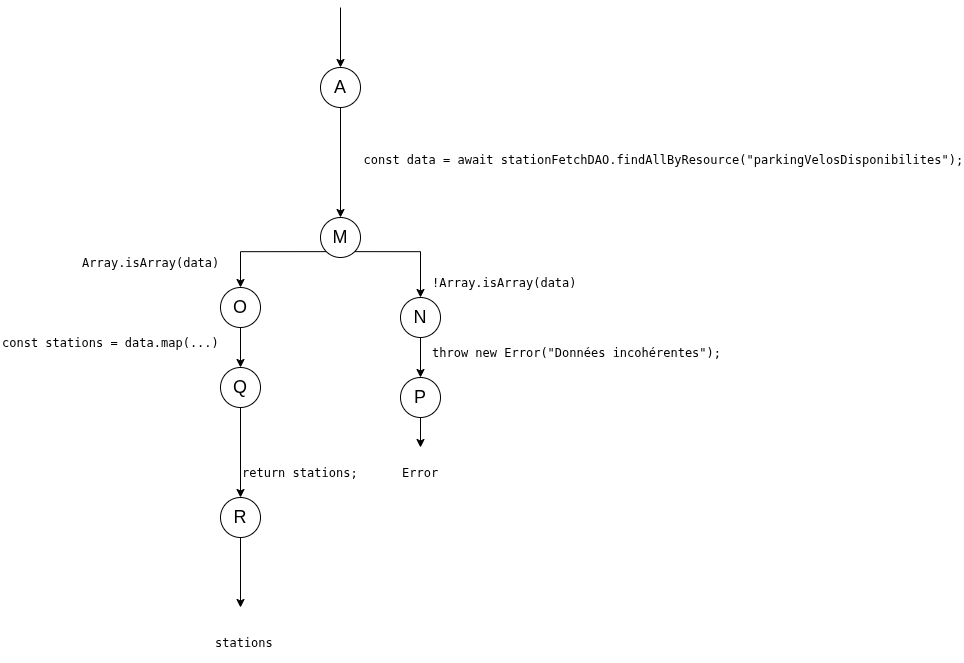

# Tests de recuperation - `recuperationTraitementDAO`

## Tests fonctionnels

### Etape n1

L'oracle verifie que `findAll` retourne soit :

- une liste d'objets `Station` construits a partir des donnees brutes,
- soit une erreur quand la recuperation ou la transformation echoue.

### Etape n2

`recuperationTraitementDAO.findAll` ne prend pas de parametre direct.
Le comportement depend de :

- `stationFetchDAO.findAllByResource(...)`,
- la validite du tableau recupere,
- la validite de chaque station lors de la construction des objets metier.

### Etape n3

Les cas de test sont definis par les reponses possibles de la dependance `stationFetchDAO` et par la validation metier des stations.

## Tests structurels

Le flux principal est le suivant :

- recuperation des donnees (`findAllByResource`)
- verification `Array.isArray(data)`
- transformation de chaque element en `Station`
- retour de la liste de stations

Branches d'erreur principales :

- echec de recuperation (fetch/DAO amont)
- donnees non tableau
- station invalide pendant le mapping

## Cas de tests

### Donnees de test (DT)

| ID | fetch_ok | data_array_ok | station_valide | Comportement |
|---|---|---|---|---|
| DT1 | true | true | true | Succes, retour liste `Station` |
| DT2 | false | - | - | Erreur de recuperation |
| DT3 | true | false | - | Erreur format (`Array.isArray` false) |
| DT4 | true | true | false | Erreur donnees station invalides |

### Correspondance CT <-> DT

| CT | DT | Chemin principal | Resultat attendu |
|---|---|---|---|
| CT1 | DT1(fetch_ok = true, data_array_ok = true, station_valide = true) | `fetch -> verif tableau -> mapping Station` | `return stations` |
| CT2 | DT2(fetch_ok = false) | `fetch` (erreur) | `throw error` |
| CT3 | DT3(fetch_ok = true, data_array_ok = false) | `fetch -> verif tableau` (erreur) | `throw error` |
| CT4 | DT4(fetch_ok = true, data_array_ok = true, station_valide = false) | `fetch -> verif tableau -> mapping Station` (erreur) | `throw error` |
