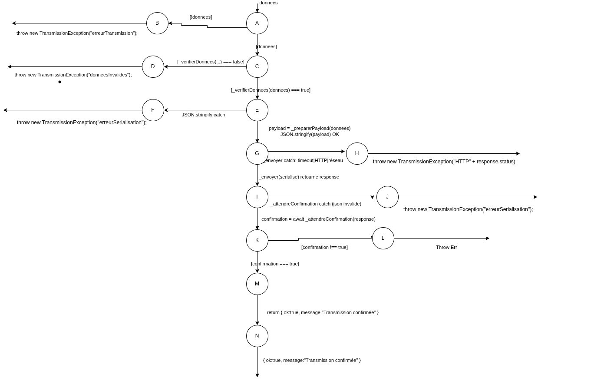

# Tests de recuperation - `transmissionClientDAO`

## Tests fonctionnels

### Etape n1

L'oracle verifie que `envoyerDonnees` retourne soit :

- un succes `{ ok: true, message: "Transmission confirmee" }`,
- soit une `TransmissionException` selon le type d'echec.

### Etape n2

`transmissionClientDAO.envoyerDonnees(donnees)` prend un objet en entree.
Le comportement depend de :

- la validite des donnees (`_verifierDonnees`),
- la serialisation (`JSON.stringify`),
- le resultat de `_envoyer` (HTTP/reseau/timeout),
- la confirmation retournee par `_attendreConfirmation`.

### Etape n3

Les cas de test sont definis par des mocks de `fetch` et des donnees d'entree valides/invalides.

## Tests structurels

Le flux principal est le suivant :

- verification des donnees
- preparation du payload
- serialisation JSON
- envoi HTTP
- attente confirmation
- retour succes

Branches d'erreur couvertes :

- donnees invalides
- erreur de serialisation
- erreur de transmission (reseau/HTTP/abort)
- confirmation negative (timeout metier)

## Cas de tests

### Donnees de test (DT)

| ID | Entree / contexte | Comportement |
|---|---|---|
| DT1 | `donnees = {a:1}`, `fetch` 200, `confirmation = true` | Succes |
| DT2 | `donnees = null` | Donnees invalides |
| DT3 | `donnees = {}` | Donnees invalides |
| DT4 | donnees circulaires (JSON.stringify en erreur) | Erreur serialisation |
| DT5 | `donnees = {a:1}`, `_envoyer` abort/timeout reseau | Erreur transmission |
| DT6 | `donnees = {a:1}`, `_envoyer` HTTP 500 | Erreur transmission |
| DT7 | `donnees = {a:1}`, `_attendreConfirmation` JSON invalide | Erreur serialisation |
| DT8 | `donnees = {a:1}`, `_attendreConfirmation` retourne false | Timeout metier |

### Correspondance CT <-> DT

| CT | DT | Chemin principal | Resultat attendu |
|---|---|---|---|
| CT1 | DT1(donnees = {a:1}, fetch 200, confirmation = true) | `verif -> payload -> stringify -> envoyer -> confirmation` | `{ok: true, message: "Transmission confirmee"}` |
| CT2 | DT2(donnees = null) | `verif donnees` (erreur) | `throw TransmissionException("donneesInvalides")` |
| CT3 | DT3(donnees = {}) | `verif donnees` (erreur) | `throw TransmissionException("donneesInvalides")` |
| CT4 | DT4(donnees circulaires) | `verif -> payload -> stringify` (erreur) | `throw TransmissionException("erreurSerialisation")` |
| CT5 | DT5(donnees = {a:1}, abort/timeout) | `verif -> payload -> stringify -> envoyer` (erreur) | `throw TransmissionException("erreurTransmission")` |
| CT6 | DT6(donnees = {a:1}, HTTP 500) | `verif -> payload -> stringify -> envoyer` (erreur) | `throw TransmissionException("erreurTransmission")` |
| CT7 | DT7(donnees = {a:1}, confirmation JSON invalide) | `verif -> payload -> stringify -> envoyer -> confirmation` (erreur) | `throw TransmissionException("erreurSerialisation")` |
| CT8 | DT8(donnees = {a:1}, confirmation = false) | `verif -> payload -> stringify -> envoyer -> confirmation` (erreur) | `throw TransmissionException("timeout")` |
