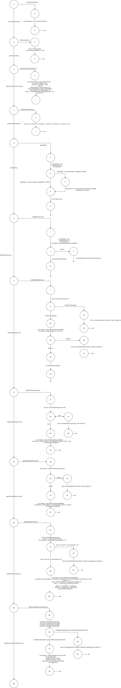

# Tests structurels - `stationController`

## Flux global

Le controleur suit ce schema general :

- appel de `updateBD()` pour recuperer le cache de stations,
- validation des parametres (path/query),
- filtrage/calcul (ville, statut, distance, itineraire),
- reponse HTTP (`200`),
- ou branche d'erreur (`400`, `404`, `502`).

## Branches a couvrir (ordre des routes)

### 1) `getStations`

- chemin nominal : `updateBD OK -> res 200`
- chemin erreur : `exception -> catch -> res 502`

### 2) `getStationsByCity`

- branche `city invalide -> res 400`
- branche `city valide -> filtre -> res 200`
- branche erreur DAO -> `res 502`

### 3) `getStationsByStatus`

- branche `status invalide -> res 400`
- branche `status valide -> filtre -> res 200`
- branche erreur DAO -> `res 502`

### 4) `getStationsNear`

- branche `params geo invalides -> res 400`
- branche nominale :
  - lecture stations valides (lat/lon),
  - calcul `distanceKm`,
  - filtre rayon,
  - tri croissant,
  - `res 200`
- branche erreur DAO -> `res 502`

### 5) `getItineraryBetweenPoints`

- branche `coordonnees invalides -> res 400`
- branche nominale : `distanceKm(latA,lonA,latB,lonB) -> res 200`
- branche erreur interne -> `res 502`

### 6) `getStationById`

- branche `id non entier -> res 400`
- branche `id entier + station absente -> res 404`
- branche `id entier + station trouvee -> res 200`
- branche erreur DAO -> `res 502`

## Donnees de test (DT)

| ID | Route cible | Donnees | Branche visee |
|---|---|---|---|
| DT1 | `/stations` | DAO OK | nominale 200 |
| DT2 | `/stations` | DAO throw | erreur 502 |
| DT3 | `/stations/city/:city` | `city=""` | validation 400 |
| DT4 | `/stations/city/Nantes` | liste mixte | filtre 200 |
| DT5 | `/stations/status/:status` | `status=""` | validation 400 |
| DT6 | `/stations/status/Disponible` | liste mixte | filtre 200 |
| DT7 | `/stations/near` | `lat/lon` invalides | validation 400 |
| DT8 | `/stations/near` | coordonnees valides + rayon | calcul/tri 200 |
| DT9 | `/stations/itinerary` | A/B invalides | validation 400 |
| DT10 | `/stations/itinerary` | A/B valides | calcul distance 200 |
| DT11 | `/stations/:id` | `id="abc"` | validation 400 |
| DT12 | `/stations/999999` | id entier absent | 404 |
| DT13 | `/stations/1` | id entier present | 200 |

## Correspondance CT <-> DT

| CT | DT | Chemin principal | Resultat attendu |
|---|---|---|---|
| CT1 | DT1 | `getStations -> updateBD OK` | `200 + stations[]` |
| CT2 | DT2 | `getStations -> catch` | `502` |
| CT3 | DT3 | `getStationsByCity -> city invalide` | `400` |
| CT4 | DT4 | `getStationsByCity -> filtre` | `200` |
| CT5 | DT5 | `getStationsByStatus -> status invalide` | `400` |
| CT6 | DT6 | `getStationsByStatus -> filtre` | `200` |
| CT7 | DT7 | `getStationsNear -> params invalides` | `400` |
| CT8 | DT8 | `getStationsNear -> distance + tri` | `200` |
| CT9 | DT9 | `getItineraryBetweenPoints -> params invalides` | `400` |
| CT10 | DT10 | `getItineraryBetweenPoints -> calcul distance` | `200` |
| CT11 | DT11 | `getStationById -> id invalide` | `400` |
| CT12 | DT12 | `getStationById -> station absente` | `404` |
| CT13 | DT13 | `getStationById -> station trouvee` | `200` |

